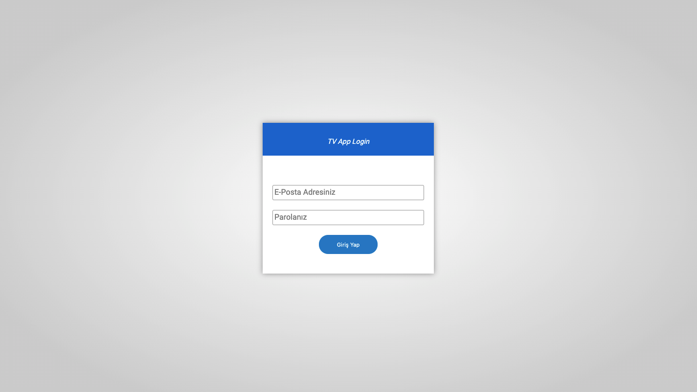
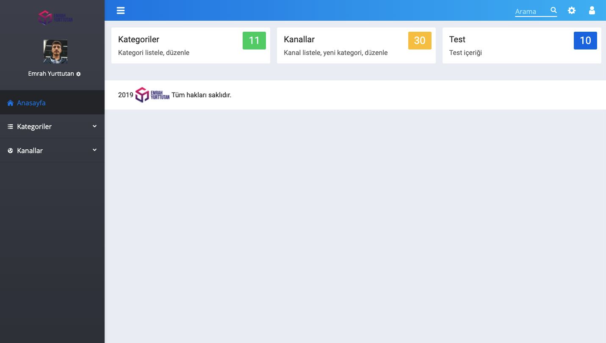
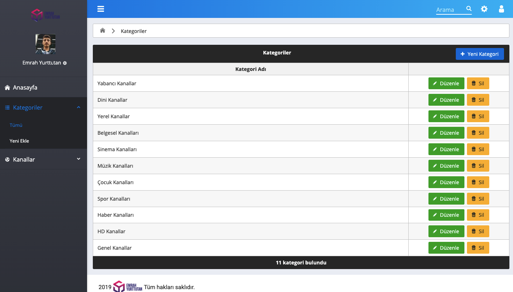

# 🚀 TV Admin UI React

React admin template react router dom, redux, primereact ui.
 

React Router Dom
 

 

Prime React

## ScreenShot

## Getting Started

1. Clone this repo, `git clone https://github.com/emrahyurttutan/tv-app <your project name>`
2. Go to project's root directory, `cd <your project name>`
3. Remove `.git` folder, `rm -rf .git`
4. Run `yarn` or `npm install` to install dependencies
5. Start the packager with `yarn start` or `npm start`
6. Default Email `emrah@yurttutan.net` Password `emrah`
