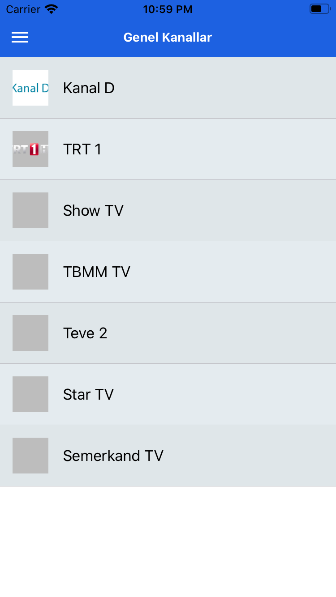
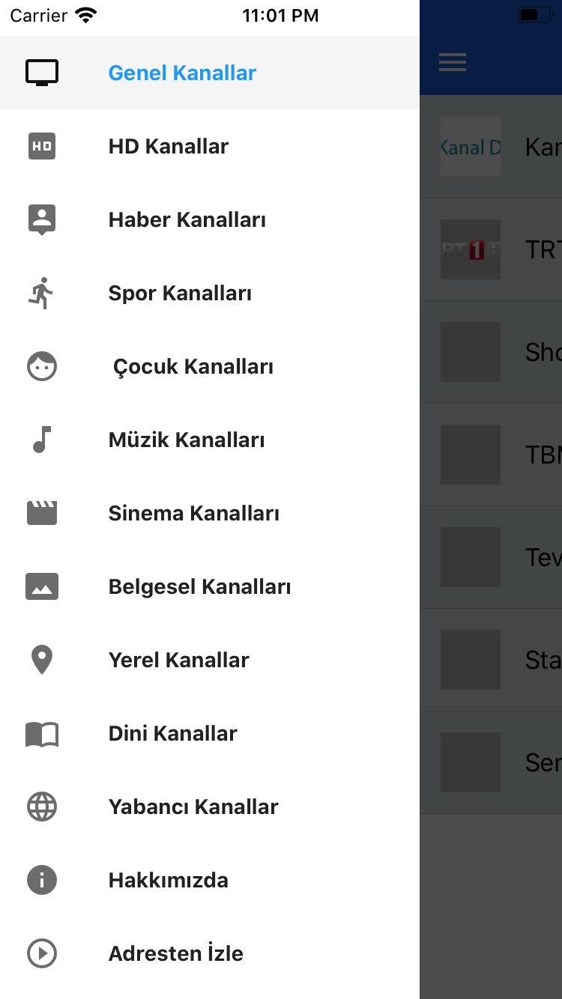

# 🚀 TV Mobile App

<a href='https://expo.io/@emrahyurttutan/tvapp'>
Expo Demo
</a>
 
React native application
 
Google Analytics  
Google Admob  
React Native Elements
 

## Getting Started

1. Clone this repo, `git clone https://github.com/emrahyurttutan/tv-app <your project name>`
2. Go to project's root directory, `cd <your project name>`
3. Remove `.git` folder, `rm -rf .git`
4. Run `yarn` or `npm install` to install dependencies
5. Start the packager with `yarn start` or `npm start`
6. Google Analytics Id `constants/Const.js` analycticsKey change `UA-11-11`
7. Google Admob Key `components/Admob/index.js`

## Screenshoot

